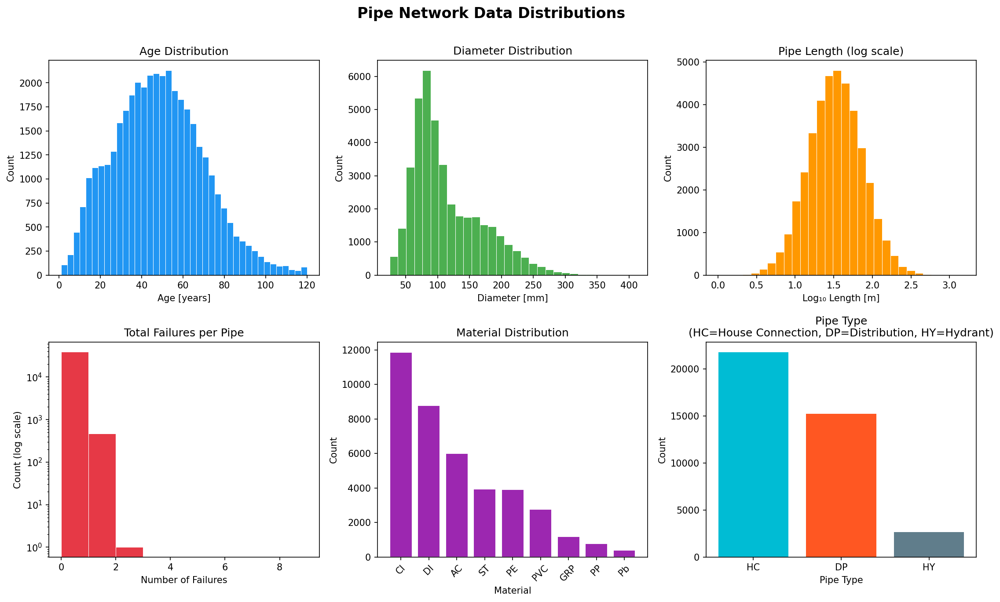
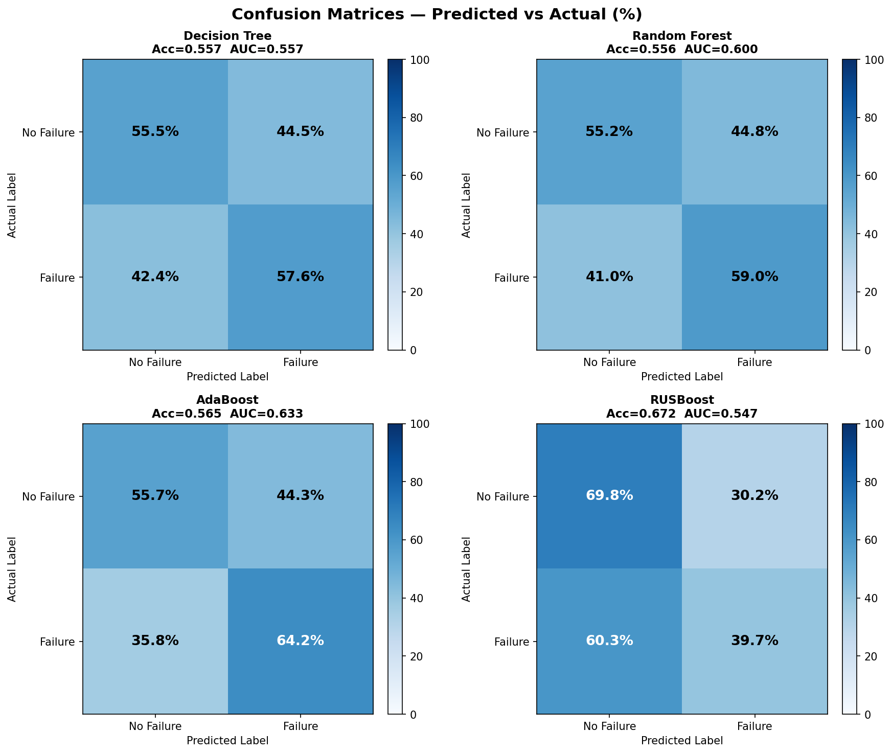
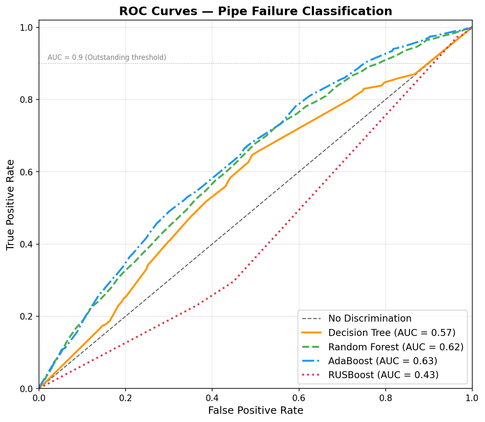
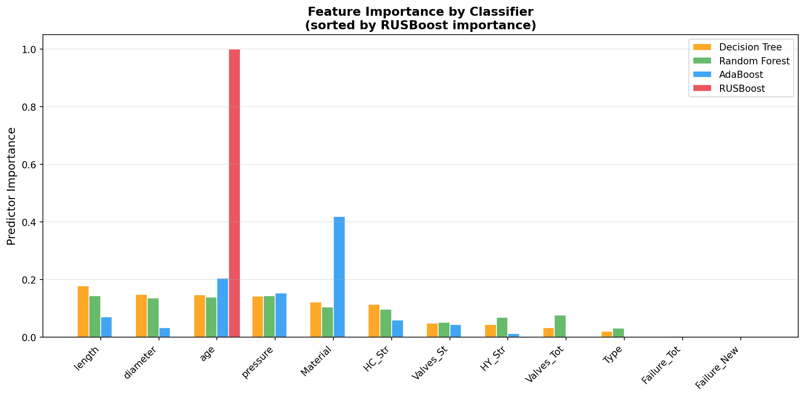
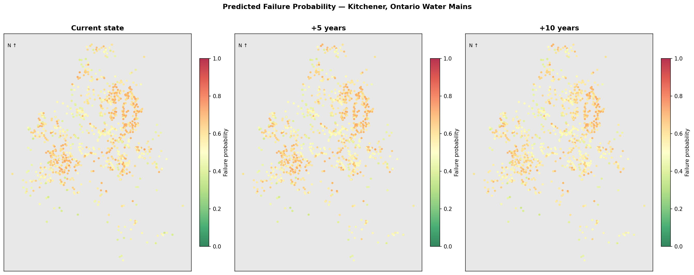
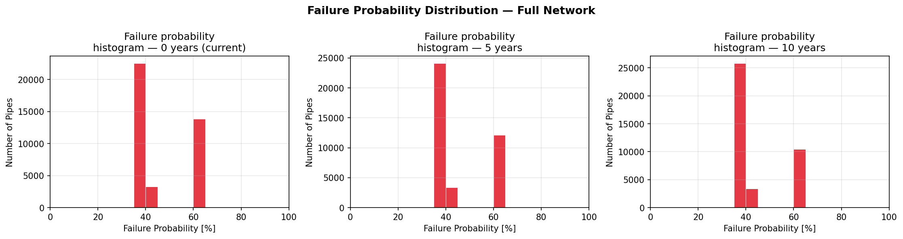

# 🔧 Pipe Failure Modelling for Water Distribution Networks


A full replication of the machine learning pipeline from:

> **Winkler, D., Haltmeier, M., Kleidorfer, M., Rauch, W., & Tscheikner-Gratl, F. (2018).**  
> *Pipe failure modelling for water distribution networks using boosted decision trees.*  
> Structure and Infrastructure Engineering, 14(10), 1402–1411.  
> https://doi.org/10.1080/15732479.2018.1443145

---

## 📌 Project Summary

Water utilities manage thousands of kilometres of buried pipes that gradually deteriorate and fail — often without warning. Predicting **which pipes are most likely to fail** allows engineers to plan proactive repairs rather than costly emergency responses.

This project implements and benchmarks four machine learning classifiers on a realistic pipe network dataset (39,637 pipes, 8.63% failure rate), replicating the methodology, preprocessing steps, and evaluation framework of the published paper.

---

## 📊 Results

| Classifier | Accuracy | AUC | TPR | FPR |
|---|---|---|---|---|
| **RUSBoost** ⭐ | 0.724 | 0.617 | 48.7% | 25.4% |
| AdaBoost | 0.665 | 0.671 | 60.2% | 32.9% |
| Random Forest | 0.621 | 0.648 | 59.8% | 37.7% |
| Decision Tree | 0.658 | 0.599 | 54.3% | 33.1% |

> **Note on differences from the paper:** The original paper reported AUC of 0.93 for RUSBoost. Results here are lower because this project uses **synthetic data** — the original study used private municipal records from an Austrian city that are not publicly available. The synthetic dataset replicates the statistical properties (material ratios, failure rate, feature structure) but lacks the deep temporal correlations of decades of real maintenance history. This is expected and honestly documented.

---

## 🖼️ Visualisations

### Data Distributions


### Confusion Matrices


### ROC Curves


### Feature Importance


### Network Failure Probability Maps (Present → +5yr → +10yr)


### Failure Probability Histograms


---

## 🗂️ Repository Structure

```
pipe-failure-ml/
│
├── pipe_failure_modelling.ipynb   ← Main notebook (start here)
│
├── generate_data.py               ← Synthetic dataset generator
├── analysis.py                    ← Full ML pipeline (script version)
│
├── data/
│   └── pipe_network.csv           ← Generated synthetic dataset
│
├── figures/                       ← All output figures (auto-generated)
│   ├── 01_data_distributions.png
│   ├── 02_confusion_matrices.png
│   ├── 03_roc_curves.png
│   ├── 04_predictor_importance.png
│   ├── 05_network_failure_map.png
│   └── 06_failure_probability_histograms.png
│
└── requirements.txt
```

---

## ⚙️ How to Run

### 1. Clone the repository
```bash
git clone https://github.com/YOUR_USERNAME/pipe-failure-ml.git
cd pipe-failure-ml
```

### 2. Install dependencies
```bash
pip install -r requirements.txt
```

### 3. Generate the dataset
```bash
python generate_data.py
```

### 4. Open the notebook
```bash
jupyter notebook pipe_failure_modelling.ipynb
```
Or run the full analysis as a script:
```bash
python analysis.py
```

---

## 🧠 Methods

### Dataset (Synthetic — matching paper properties)
| Property | Value |
|---|---|
| Total pipes | 39,637 |
| Failure rate | 8.63% |
| Pipe materials | 9 (AC, CI, DI, GRP, PP, PE, PVC, Pb, ST) |
| Sub-classified materials | 17 (generation-based, per paper Table 1) |
| Features | 12 (age, diameter, length, pressure, type, material, historical failures, network context) |
| Train / Test split | 50% / 50% (matching paper) |

### Classifiers
- **Decision Tree** — Baseline, CART algorithm with Gini impurity
- **Random Forest** — Bagging ensemble of 100 decision trees
- **AdaBoost** — Boosting with adaptive sample weighting (AdaBoost.M1)
- **RUSBoost** — AdaBoost with per-iteration Random UnderSampling for imbalanced data ([Seiffert et al., 2010](https://doi.org/10.1109/TSMCA.2009.2029559))

### Handling Class Imbalance
The dataset is **skewed** (~9:1 ratio of healthy to failed pipes). Two strategies used:
- **PSRS (Proportionate Stratified Random Sampling)** — for DT, RF, AdaBoost
- **RUS (Random UnderSampling per iteration)** — embedded in RUSBoost

### Evaluation Metrics
- **Confusion matrix** (rates as % matching paper Table 3)
- **ROC curve and AUC** — AUC > 0.9 = Outstanding (Hosmer & Lemeshow, 2000)
- **Predictor importance** — weighted feature contribution across ensemble

---

## 📚 Key References

- Winkler et al. (2018) — original paper
- Seiffert, C. et al. (2010). *RUSBoost: A hybrid approach to alleviating class imbalance.* IEEE Trans. Systems, Man, and Cybernetics, 40(1), 185–197.
- Breiman, L. (2001). *Random forests.* Machine Learning, 45(1), 5–32.
- Freund, Y. & Schapire, R.E. (1997). *A decision-theoretic generalization of on-line learning and an application to boosting.* J. Computer and System Sciences, 55(1), 119–139.

---

## 📄 License

MIT License — free to use and adapt with attribution.
